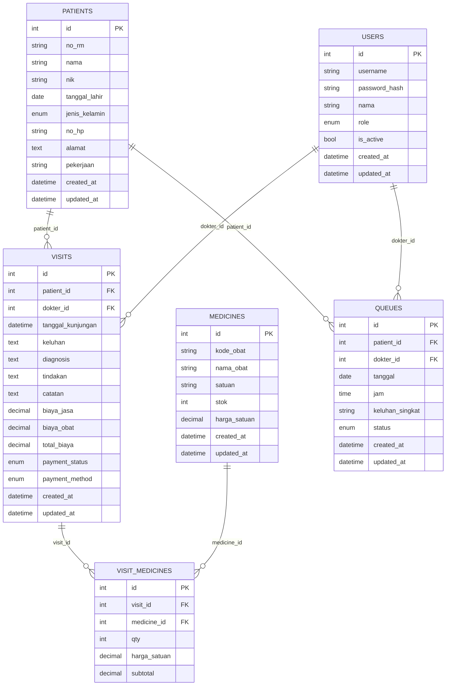

# Klinik Dashboard

Aplikasi web sederhana untuk mengelola data pasien, rekam medis, obat, antrian, dan laporan pendapatan klinik.

Dibangun dengan PHP + MySQL tanpa framework besar, fokus pada alur kerja klinik kecil/menengah.

---

## ERD



## Fitur Utama

### Manajemen User & Hak Akses

- Login dengan role:
  - **Admin/Owner** – full akses (master data, laporan, manajemen user)
  - **Dokter** – mengelola kunjungan/rekam medis, melihat pasien dan antrian sendiri
  - **Resepsionis** – pendaftaran pasien, input kunjungan dasar, antrian
- Password disimpan dengan `password_hash()` (bcrypt)
- Proteksi CSRF di semua form POST
- Session security:
  - Session cookie HttpOnly, SameSite=Lax
  - Session timeout idle + max lifetime
  - Rate-limiting login (percobaan gagal dibatasi)

### Master Data

- **Pasien**
  - No Rekam Medis (auto)
  - Identitas dasar (nama, tanggal lahir, jenis kelamin, alamat, no HP, pekerjaan)
  - Pencarian + filter:
    - teks bebas (nama / no RM / no HP)
    - jenis kelamin
    - rentang umur
    - diagnosis terakhir / histori kunjungan (via join ke visits)
  - Pagination pada daftar pasien

- **Obat**
  - Nama, satuan, stok sederhana, harga satuan
  - CRUD master obat
  - Dipakai di input kunjungan (multi-obat per kunjungan)

### Rekam Medis / Kunjungan

- Input kunjungan per pasien:
  - Tanggal kunjungan
  - Dokter penanggung jawab
  - Keluhan, diagnosis, tindakan, catatan
  - Biaya jasa klinik/dokter
  - Pilihan obat (multi-row):
    - Obat, Qty, Harga satuan, Subtotal
  - Perhitungan otomatis total biaya jasa + obat
- Status & metode pembayaran:
  - `payment_status`: `belum_bayar`, `lunas`, `gratis`, `piutang`
  - `payment_method`: `tunai`, `transfer`, `qris`, `bpjs`, `asuransi_lain`, `lainnya`
- Riwayat kunjungan per pasien + halaman detail kunjungan
- Print-out kunjungan (struk/lembar rekam medis ringkas)

### Antrian / Jadwal

- Pembuatan antrian per hari:
  - Pasien
  - Tanggal, Jam
  - Dokter
  - Keluhan singkat
- Status antrian:
  - `menunggu`, `diperiksa`, `selesai`, `batal`
- Tampilan antrian hari ini (untuk resepsionis & dokter)

### Laporan & Dashboard Owner

- Ringkasan:
  - Total kunjungan (periode)
  - Total kunjungan lunas
  - Total jasa klinik
  - Total biaya obat
  - Pendapatan dari kunjungan `lunas`
- Filter tanggal (rentang) untuk laporan
- Tampilan dashboard dengan kartu-kartu KPI

### Import / Export

- Import pasien dari file CSV (format sederhana Excel → CSV)
- Export data (mis. pengunjung) ke CSV untuk dianalisa di Excel

### Logging & Error Handling

- Semua warning/error & exception dicatat ke file log (`logs/app.log`)
- Halaman error ramah untuk user (500), detail teknis tetap aman di log
- Exception handler global + CSRF guard di entry point (`public/index.php`)

### UI/UX

- Tema warna:
  - **Healing green** (utama)
  - **Serene blue**
  - **Calming neutral** untuk latar
- Layout:
  - Sidebar kiri untuk navigasi utama
  - Header atas dengan info user
  - Tabel dibungkus `.table-wrapper` (scroll horizontal di mobile)
- Responsif:
  - Di mobile: sidebar menjadi off-canvas (buka via tombol burger)
  - Form 2 kolom otomatis menjadi 1 kolom di layar kecil
  - Tabel di mobile dapat di-swipe horizontal

---

## Stack Teknologi

- **Backend**:  
  - PHP 8.2.12
  - PDO untuk koneksi MySQL
- **Database**:  
  - MySQL / MariaDB (InnoDB, utf8mb4)
- **Frontend**:
  - HTML5, CSS3 (custom)
  - Sedikit JavaScript vanilla (tambah row obat, toggle sidebar, dsb.)
- **Lingkungan Pengembangan**:
  - XAMPP (Apache + MySQL) di lokal
- **Deploy / Hosting**:
  - InfinityFree – root di `/htdocs`

---

## Struktur Folder (ringkasan)

```text
project-root/
├─ config.php           # konfigurasi app & DB
├─ db.php               # fungsi-fungsi akses database (PDO)
├─ helpers.php          # helper umum (auth, CSRF, logging, dll)
├─ auth.php             # guard login, role, dll
├─ create_admin.php     # skrip satu-kali untuk membuat admin awal
├─ public/
│  ├─ index.php         # front controller (entry point HTTP)
│  └─ assets/
│     ├─ css/style.css  # styling UI
│     └─ js/app.js      # JS ringan (UI interaksi)
└─ views/
   ├─ partials/         # header, sidebar, layout
   ├─ auth/             # halaman login
   ├─ patients_*.php    # list, form, detail pasien
   ├─ visits_*.php      # input & detail kunjungan, print
   ├─ medicines_*.php   # CRUD obat
   ├─queues_*.php       # antrian
   └─ reports_*.php     # laporan & dashboard
